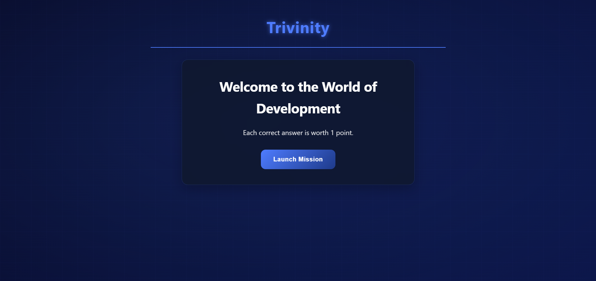
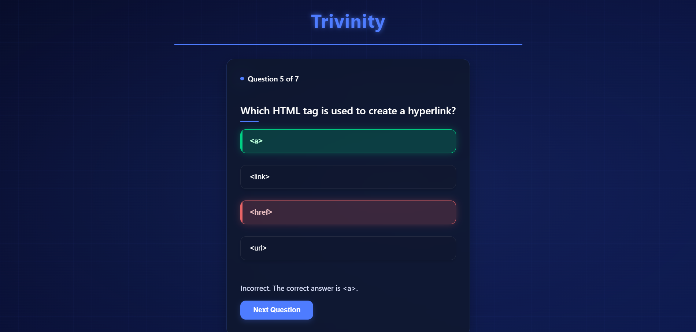
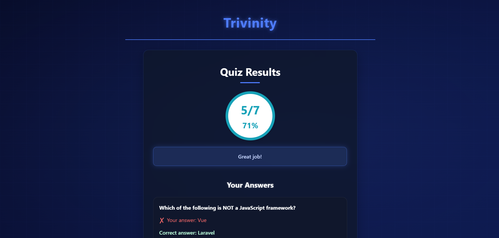

# Trivinity - Web Development Quiz App 🚀

Welcome to **Trivinity** — a fun and interactive web development quiz app built with **React**! 🎮 Whether you're a beginner or an experienced developer, test your knowledge on topics like **JavaScript**, **HTML**, **CSS**, and **popular web frameworks**. It's the perfect tool to improve your coding skills and challenge yourself! 💻✨

---

## 🌟 Features

- **Interactive Quiz**: Test your knowledge with multiple-choice questions across various web development topics. 📚
- **Score Tracking**: See how well you did with a real-time score tracker at the end. 🏆
- **Result Breakdown**: Get a detailed result screen showing your performance and the correct answers. 📊
- **Responsive Design**: Works beautifully across devices from desktops to mobile phones. 📱
- **Simple UI**: A clean and easy-to-use interface for an effortless quiz-taking experience. 🎨

---

## ⚡ Getting Started

### 🛠️ Prerequisites

To run this app locally, you'll need:

- [Node.js](https://nodejs.org/) (v14 or higher) 🖥️
- [npm](https://www.npmjs.com/) (Node's package manager) 📦

### 💻 Installation

Follow these steps to get the app running on your local machine:

1. Clone the repository to your local machine:

   ```bash
   git clone https://github.com/yourusername/trivinity.git

2. Navigate to the project directory:

   ```bash
   cd trivinity
   
3. Install the dependencies:

   ```bash
   npm install

4. Run the app:

   ```bash
   npm start

5. Open http://localhost:3000 in your browser to start the quiz! 🎮

## 📝 How to Use

1. **Start Screen**:
   - When you open the app, you'll see an intro screen with a button to start the quiz. 🎬
   - Click **Start Quiz** to begin your journey! 🌟

2. **Taking the Quiz**:
   - The quiz consists of multiple-choice questions. 📋
   - Select your answer and hit **Next** to proceed to the next question. ⏭️

3. **Results Screen**:
   - After completing the quiz, you'll see your **score** and a breakdown of your answers. 📝
   - You can review the correct answers to learn from your mistakes. 📚

4. **Restarting the Quiz**:
   - Want to try again? Just click **Restart** on the results screen to begin a new quiz. 🔄

## 📂 Project Structure

Here’s an overview of the key files and components in the project:

- **`App.js`**: The root component managing the quiz flow (start, quiz, and results screens). 🏠
- **`QuizContainer.js`**: Displays the quiz questions, collects answers, and tracks progress. 📋
- **`StartScreen.js`**: A simple screen with a button to begin the quiz. 🎬
- **`ResultScreen.js`**: Shows the user’s score and a detailed breakdown of the quiz results. 📊
- **`App.css`**: Contains the styles and layout for the application. 🎨
- **`quizData.js`**: Contains the questions, options, and correct answers for the quiz. 📚


## 🤝 Contributing

We welcome contributions to **Trivinity**! If you'd like to improve the project, feel free to fork the repository and submit a pull request. 🙌

### How to Contribute:

1. Fork the repository. 🍴
2. Create a new branch: `git checkout -b feature-name`. 🌱
3. Make your changes and commit them: `git commit -am 'Add feature'`. ✏️
4. Push to your branch: `git push origin feature-name`. 🚀
5. Submit a pull request with a description of your changes. 📥


## 💡 Acknowledgments

- Thanks to **React** for making building this app super easy! ⚛️
- Huge shoutout to all open-source contributors for their tools and inspiration! 🌍
- **FontAwesome** for their awesome icons used in the project. 🖼️
- **React Icons** for easy access to a variety of icons. 📦


## 📸 Screenshots

Here are some screenshots of the **Trivinity** quiz app in action!

### 1. Start Screen


### 2. Quiz Screen


### 3. Results Screen



